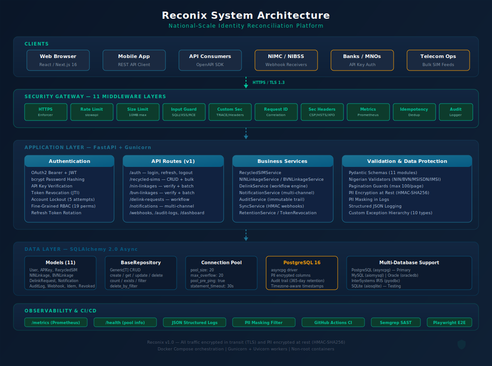
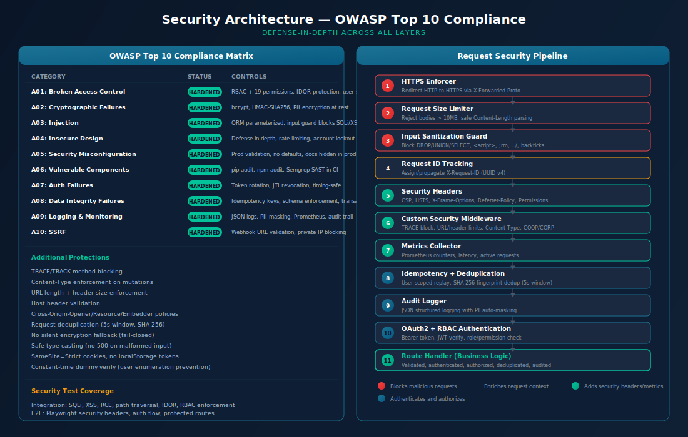
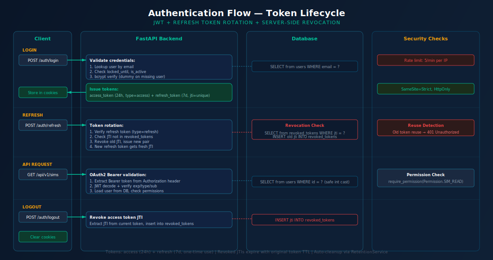

<p align="center">
  
</p>

<h1 align="center">
  
  Reconix
</h1>

<p align="center">
  <strong>Identity Reborn, Secure by Design</strong><br/>
  National-scale identity reconciliation platform for Nigeria
</p>

<p align="center">
  
  
  
  
  
  
  
  
  
</p>

---

## The Problem

When Nigerian telecom operators recycle inactive phone numbers, those numbers frequently retain old identity linkages in national databases:

- **NIN (National Identification Number)** linkages via NIMC
- **BVN (Bank Verification Number)** linkages via NIBSS
- **Bank account** associations via financial institutions

This creates identity conflicts, fraud vectors, and operational failures affecting millions of Nigerians. A new SIM owner inherits the previous owner's identity bindings, enabling unauthorized access to bank accounts, government services, and personal data.

## The Solution

Reconix is the **single source of truth** for identity-to-SIM mappings. It connects outbound to stakeholder systems (NIMC, NIBSS, telecoms, banks), aggregates their data, and exposes a corroborated picture. No stakeholder writes to Reconix; Reconix does not write to any stakeholder system.

1. **Aggregate** — Pull NIN/BVN/SIM data from NIMC, NIBSS, and telecom APIs via secure HTTPS adapters
2. **Corroborate** — Cross-reference multiple sources, compute confidence scores, detect conflicts
3. **Detect** — Identify recycled SIM numbers with stale identity linkages
4. **Reconcile** — Automate the delinking workflow with multi-step approval
5. **Notify** — Alert affected parties (former owners, banks, NIMC) via multi-channel dispatch
6. **Audit** — Log every action with an immutable, tamper-evident trail

```text
   NIMC ◄──── READ ────┐
   NIBSS ◄──── READ ───┤
   Telecoms ◄── READ ──┤   Reconix    ────── READ ──────► Stakeholders
   Banks ◄──── READ ───┘  (aggregator)                   (query the
                                                           unified picture)
   No writes in either direction — read-only aggregation
```

---

## Architecture

<p align="center">
  
</p>

### Security Architecture

<p align="center">
  
</p>

### Authentication Flow

<p align="center">
  
</p>

---

## Tech Stack

| Layer          | Technology                          | Purpose                                                               |
| -------------- | ----------------------------------- | --------------------------------------------------------------------- |
| **Backend**    | FastAPI + Gunicorn + Uvicorn        | Async Python API with multi-worker concurrency                        |
| **Frontend**   | Next.js 16 + React 18 + TypeScript  | Server-side rendered dashboard with App Router                        |
| **Database**   | PostgreSQL 16 (asyncpg)             | Primary store with connection pooling and PII encryption              |
| **ORM**        | SQLAlchemy 2.0 (async)              | Multi-database support (PostgreSQL, MySQL, Oracle, InterSystems IRIS) |
| **Auth**       | JWT + OAuth2 Bearer + RBAC          | Token rotation, server-side revocation, 19 granular permissions       |
| **Validation** | Pydantic v2 + Zod                   | Schema enforcement on both backend and frontend                       |
| **UI**         | Tailwind CSS + Recharts + Lucide    | Responsive dashboard with real-time charts                            |
| **State**      | Zustand                             | Lightweight client-side state management                              |
| **Testing**    | pytest + Jest + Playwright + k6     | 678 tests across unit, component, integration, E2E, and load tests    |
| **CI/CD**      | GitHub Actions                      | Lint, test, type-check, SCSS, Docker build, pip-audit, Semgrep SAST   |
| **Containers** | Docker + Docker Compose             | Non-root images, multi-stage builds, health checks                    |
| **Caching**    | Redis (optional)                    | Token blacklist, query caching, with in-memory fallback               |
| **Secrets**    | HashiCorp Vault (optional)          | Vault KV v2 with environment variable fallback                        |
| **Monitoring** | Sentry + Prometheus + health poller | Error tracking, metrics, uptime monitoring                            |
| **WebSocket**  | FastAPI WebSocket                   | Real-time notifications with channel-based pub/sub                    |

---

## Project Structure

```text
reconix/
├── fast_api/                        # Backend (FastAPI)
│   ├── main.py                      # App factory, lifespan, 14 middleware layers
│   ├── api.py                       # Router aggregation (13 route modules)
│   ├── config.py                    # Pydantic settings with production validation
│   ├── db.py                        # Async engine factory, BaseRepository[T], read replica
│   ├── websocket.py                 # ConnectionManager with per-user limits
│   ├── gunicorn.conf.py             # Dynamic workers, preload, max_requests recycling
│   ├── logging_config.py            # Structured JSON logging + PII masking
│   ├── crypto.py                    # Application-level PII field encryption
│   ├── auth/authlib/                # OAuth2, JWT, bcrypt, RBAC, 19 permissions
│   ├── routes/                      # 13 route modules (+ identity, data_subject, ws)
│   ├── services/                    # 14 business services (+ adapters, corroboration)
│   ├── models/                      # 12 SQLAlchemy models (+ stakeholder)
│   ├── schemas/                     # 12 Pydantic schema modules
│   ├── middleware/                   # 14 security/observability middleware
│   ├── validators/                  # Nigerian data validators (NIN/BVN/MSISDN/IMSI)
│   ├── exceptions/                  # 10 custom exception types + handlers
│   ├── alembic/                     # Database migrations (async, all models imported)
│   └── tests/                       # unit/ + component/ + integration/
├── src/                             # Frontend (Next.js)
│   ├── app/                         # App Router pages (9 routes)
│   ├── components/                  # 22 feature components (+ notification-bell)
│   ├── hooks/                       # useAuth, usePagination, useApiQuery, useDebounce, useWebSocket
│   ├── services/                    # 9 API service modules (+ websocket, data-subject)
│   ├── types/                       # TypeScript type definitions
│   └── tests/                       # Integration tests
├── e2e/                             # Playwright E2E tests
│   ├── playwright.config.ts
│   └── tests/                       # auth, security, navigation specs
├── docs/                            # Documentation
│   ├── architecture/                # SVG diagrams, Mermaid flows
│   ├── data-model/                  # ERD and schema docs
│   ├── srs/                         # Software Requirements Specification
│   ├── proposal/                    # Formal project proposal
│   ├── policy-brief/                # NCC/NIMC/NIBSS policy brief
│   └── pitch-deck/                  # Stakeholder presentation
├── scripts/
│   ├── generate_sdk.py              # OpenAPI client SDK generator
│   ├── backup_db.py                 # PostgreSQL backup with retention
│   ├── restore_db.py                # PostgreSQL restore with validation
│   ├── health_check.py              # Uptime monitoring health poller
│   ├── seed_admin.py                # Initial admin user setup
│   └── check_secrets.py             # Pre-commit secret leak scanner
├── load_tests/
│   ├── k6_auth.js                   # Auth flow load test (50 VUs)
│   ├── k6_api.js                    # API read-heavy load test (100 VUs)
│   └── k6_stress.js                 # Stress test (500 VUs)
├── infra/k8s/
│   ├── deployment.yaml              # K8s deployment, service, PDB, HPA
│   └── multi-region.yaml            # Multi-region ingress, secrets, failover
├── .github/workflows/
│   ├── ci.yml                       # CI: test, lint, Docker build, security scan
│   └── pages.yml                    # GitHub Pages deployment (Jekyll RTD)
├── .githooks/pre-commit             # Python secret scanner hook
├── docker-compose.yml               # Orchestration (localhost-only DB port)
├── Dockerfile                       # Multi-stage: Python 3.13 + Node 24
├── gunicorn.conf.py                 # Dynamic workers, preload, max_requests
└── ROADMAP.md                       # Production readiness tracker
```

---

## API Endpoints

| Method | Endpoint                               | Auth           | Description                                          |
| ------ | -------------------------------------- | -------------- | ---------------------------------------------------- |
| `POST` | `/api/v1/auth/login`                   | Public         | Authenticate, returns JWT + refresh token            |
| `POST` | `/api/v1/auth/refresh`                 | Public         | Rotate refresh token (one-time use, old JTI revoked) |
| `POST` | `/api/v1/auth/logout`                  | Bearer         | Revoke access token JTI                              |
| `GET`  | `/api/v1/recycled-sims`                | Bearer         | List recycled SIMs (paginated, filterable)           |
| `POST` | `/api/v1/recycled-sims`                | Admin/Operator | Register a recycled SIM                              |
| `POST` | `/api/v1/recycled-sims/bulk`           | Admin          | Bulk upload (up to 10,000 records)                   |
| `POST` | `/api/v1/nin-linkages/verify`          | Bearer         | Verify NIN linkage for an MSISDN                     |
| `POST` | `/api/v1/nin-linkages/bulk-check`      | Bearer         | Batch NIN check (single query, no N+1)               |
| `POST` | `/api/v1/bvn-linkages/verify`          | Bearer         | Verify BVN linkage for an MSISDN                     |
| `POST` | `/api/v1/bvn-linkages/bulk-check`      | Bearer         | Batch BVN check (single query, no N+1)               |
| `POST` | `/api/v1/delink-requests`              | Admin/Operator | Create delink request                                |
| `POST` | `/api/v1/delink-requests/{id}/approve` | Admin          | Approve/reject delink                                |
| `GET`  | `/api/v1/dashboard/stats`              | Bearer         | Aggregated statistics                                |
| `GET`  | `/api/v1/dashboard/trends`             | Bearer         | Trends over configurable period                      |
| `GET`  | `/api/v1/audit-logs`                   | Admin/Auditor  | Immutable audit trail                                |
| `POST` | `/api/v1/retention/purge-audit-logs`   | Admin          | Purge expired audit logs                             |
| `POST` | `/api/v1/webhooks/register`            | Admin/Operator | Register webhook subscription                        |
| `GET`  | `/api/v1/data-subject/privacy-policy`  | Public         | NDPR privacy policy                                  |
| `GET`  | `/api/v1/data-subject/my-data`         | Bearer         | Export personal data (NDPR right of access)          |
| `POST` | `/api/v1/data-subject/delete-my-data`  | Bearer         | Request data deletion (NDPR right to erasure)        |
| `GET`  | `/api/v1/data-subject/consent`         | Bearer         | View consent record                                  |
| `POST` | `/api/v1/data-subject/access-request`  | Bearer         | Submit NDPR data subject access request              |
| `POST` | `/api/v1/recycled-sims/detect`         | Admin          | Detection scan: flag SIMs with stale linkages        |
| `GET`  | `/api/v1/identity/msisdn/{num}/status` | Bearer         | MSISDN lifecycle status and assignment readiness     |
| `GET`  | `/api/v1/identity/msisdn/{n}/linkages` | Bearer         | Full NIN/BVN linkage history for an MSISDN           |
| `GET`  | `/api/v1/identity/lookup`              | Bearer         | Unified identity mapping with confidence score       |
| `POST` | `/api/v1/identity/batch-lookup`        | Admin/Operator | Batch identity mapping (up to 100 MSISDNs)           |
| `GET`  | `/api/v1/identity/corroborate`         | Admin          | Cross-reference with external stakeholder systems    |
| `GET`  | `/api/v1/identity/conflicts`           | Admin/Auditor  | List data conflicts across sources                   |
| `WS`   | `/ws/{channel}`                        | Bearer (query) | Real-time notifications via WebSocket                |
| `GET`  | `/health`                              | Public         | Health check with DB pool status                     |
| `GET`  | `/health/live`                         | Public         | Liveness probe (always 200)                          |
| `GET`  | `/health/ready`                        | Public         | Readiness probe (503 until DB connected)             |
| `GET`  | `/metrics`                             | Public (prod)  | Prometheus metrics (IP-restricted in production)     |

---

## Database Architecture

Reconix uses PostgreSQL 16 with async SQLAlchemy 2.0, an optional read replica for dashboard queries, and a generic `BaseRepository<T>` pattern for all CRUD operations. Connection pooling is configured at 20 + 20 overflow with pre-ping health checks.

### Entity Relationship Overview

```text
┌────────────┐     ┌────────────────┐     ┌──────────────────┐
│   users    │◄─┐  │ recycled_sims  │◄─┐  │ delink_requests  │
│            │  │  │                │  │  │                  │
│ id      PK │  │  │ id          PK │  │  │ id            PK │
│ email      │  │  │ sim_serial     │  │  │ recycled_sim_id→ │──► recycled_sims
│ role  ENUM │  │  │ msisdn         │  │  │ initiated_by  →  │──► users
│ is_active  │  │  │ imsi           │  │  │ approved_by   →  │──► users
│ locked_    │  │  │ operator_code  │  │  │ request_type     │
│  until     │  │  │ cleanup_status │  │  │ status      ENUM │
└────────────┘  │  │   ENUM         │  │  │ reason           │
   ▲  ▲  ▲      │  └────────────────┘  │  └──────────────────┘
   │  │  │      │     │ msisdn match   │           │
   │  │  │      │     ▼                │           │ FK
   │  │  │      │  ┌────────────────┐  │  ┌────────▼─────────┐
   │  │  │      │  │ nin_linkages   │  │  │  notifications   │
   │  │  │      │  │                │  │  │                  │
   │  │  │      │  │ msisdn         │  │  │ delink_request → │
   │  │  │      │  │ nin            │  │  │ recipient_type   │
   │  │  │      │  │ is_active BOOL │  │  │ channel     ENUM │
   │  │  │      │  │ source    ENUM │  │  │ status      ENUM │
   │  │  │      │  └────────────────┘  │  └──────────────────┘
   │  │  │      │  ┌────────────────┐  │
   │  │  │      │  │ bvn_linkages   │  │
   │  │  │      │  │                │  │
   │  │  │      │  │ msisdn         │  │
   │  │  │      │  │ bvn            │  │
   │  │  │      │  │ bank_code      │  │
   │  │  │      │  │ is_active BOOL │  │
   │  │  │      │  └────────────────┘  │
   │  │  │      │                      │
   │  │  └──────┼──────────────────────┘
   │  │  FK     │ FK
   │  ▼         ▼
┌──┴─────────┐ ┌─────────────┐ ┌─────────────────┐ ┌─────────────────┐
│ audit_logs │ │  api_keys   │ │ revoked_tokens  │ │idempotency_keys │
│ (IMMUTABLE)│ │             │ │                 │ │                 │
│ user_id  → │ │ user_id   → │ │ jti      UNIQUE │ │ key      UNIQUE │
│ action     │ │ key_hash    │ │ expires_at      │ │ response_body   │
│ resource_  │ │ scopes JSON │ │ user_id         │ │ expires_at      │
│  type/id   │ │ is_active   │ └─────────────────┘ └─────────────────┘
│ old/new    │ │ expires_at  │
│  value JSON│ └─────────────┘
└────────────┘
```

### Tables and Their Roles

| Table                | Records                         | Role in System                                                                 | Key Operations                                    |
| -------------------- | ------------------------------- | ------------------------------------------------------------------------------ | ------------------------------------------------- |
| **users**            | System operators and admins     | Authentication, RBAC (4 roles), account lockout after 5 failed attempts        | Login, token issuance, role checks on every route |
| **recycled_sims**    | Detected recycled SIM cards     | Core domain entity from telecom operator feeds; tracks cleanup lifecycle       | Bulk ingest, status transitions, dashboard counts |
| **nin_linkages**     | MSISDN-to-NIN bindings (NIMC)   | Verifies if recycled number still has old NIN linked; soft-delete on unlink    | Verify, bulk-check, unlink on delink completion   |
| **bvn_linkages**     | MSISDN-to-BVN bindings (NIBSS)  | Verifies if recycled number still has old BVN linked; soft-delete on unlink    | Verify, bulk-check, unlink on delink completion   |
| **delink_requests**  | Delink workflow instances       | Orchestrates delinking lifecycle: create, approve/reject, complete/fail        | State machine: PENDING to PROCESSING to COMPLETED |
| **notifications**    | Multi-channel dispatch records  | Tracks SMS/email/API notifications sent to former owners, banks, NIMC          | Queue, mark sent/delivered/failed                 |
| **audit_logs**       | Immutable compliance trail      | Every state-changing action logged with before/after values, IP, user agent    | Append-only writes; purge via retention policy    |
| **api_keys**         | M2M authentication tokens       | External system integration (telecom APIs, NIMC/NIBSS webhooks)                | Hash verification, scope checks, expiry           |
| **webhook_subs**     | Event subscriptions             | Stakeholder sync: banks and NIMC receive delink event callbacks                | Register, trigger, deactivate                     |
| **revoked_tokens**   | JWT blacklist                   | Prevents reuse of logged-out access tokens and rotated refresh tokens          | Revoke on logout/refresh, check on every auth     |
| **idempotency_keys** | Request dedup fingerprints      | Prevents double-processing of POST/PUT/PATCH requests within 5-second window   | Auto-managed by IdempotencyMiddleware             |

### Data Flow Through Tables

```text
Telecom Feed ──► recycled_sims ──► nin_linkages (verify NIN still linked?)
                      │            bvn_linkages (verify BVN still linked?)
                      ▼
               delink_requests ──► admin approves ──► nin_linkages.unlink()
                      │                               bvn_linkages.unlink()
                      │                               recycled_sims.status = COMPLETED
                      ▼
               notifications ──► SMS/Email/API to former owner, bank, NIMC
                      │
                      ▼
               audit_logs (every step logged immutably)
```

### State Machines

**RecycledSIM.cleanup_status:** `PENDING` → `IN_PROGRESS` → `COMPLETED` | `FAILED`

**DelinkRequest.status:** `PENDING` → `PROCESSING` → `COMPLETED` | `FAILED` | `CANCELLED`

**Notification.status:** `PENDING` → `SENT` → `DELIVERED` | `FAILED`

### Read Replica Routing

Dashboard and reporting queries are automatically routed to the read replica (if configured via `DATABASE_READ_REPLICA_URL`). All write operations go to the primary. If no replica is configured, all queries fall back to the primary transparently.

| Route Pattern         | Engine       | Reason                      |
| --------------------- | ------------ | --------------------------- |
| `GET /dashboard/*`    | Read replica | Aggregate COUNT queries     |
| All POST/PATCH/DELETE | Primary      | Write consistency required  |
| All other GET routes  | Primary      | Fallback when no replica    |

---

## Security

Reconix is hardened against the full OWASP Top 10:

| OWASP Category                 | Status       | Controls                                                                    |
| ------------------------------ | ------------ | --------------------------------------------------------------------------- |
| A01: Broken Access Control     | **Hardened** | RBAC (4 roles, 19 permissions), IDOR protection, user-scoped idempotency    |
| A02: Cryptographic Failures    | **Hardened** | bcrypt (12 rounds), HMAC-SHA256 PII encryption, no plaintext fallback       |
| A03: Injection                 | **Hardened** | SQLAlchemy ORM (parameterized), input guard blocks SQLi/XSS/RCE patterns    |
| A04: Insecure Design           | **Hardened** | Defense-in-depth (14 middleware layers), rate limiting, account lockout     |
| A05: Security Misconfiguration | **Hardened** | Production config validation, strict CSP (no unsafe-eval), docs hidden      |
| A06: Vulnerable Components     | **Hardened** | pip-audit + npm audit + Semgrep SAST in CI                                  |
| A07: Auth Failures             | **Hardened** | Token rotation, JTI revocation, timing-safe dummy verify, 5-attempt lockout |
| A08: Data Integrity Failures   | **Hardened** | Idempotency keys, schema enforcement, transactional writes                  |
| A09: Logging & Monitoring      | **Hardened** | Structured JSON logs, PII auto-masking, Prometheus metrics, audit trail     |
| A10: SSRF                      | **Hardened** | Webhook URL validation blocks private IPs, loopback, metadata endpoints     |

### Middleware Pipeline (14 layers)

Every request passes through:

1. **HTTPS Enforcer** — Redirect HTTP to HTTPS
2. **Sentry** — Error capture and performance monitoring
3. **Tracing** — Distributed trace ID propagation (X-Trace-ID, X-Span-ID)
4. **Sunset Headers** — API versioning deprecation with RFC 8594 Sunset header
5. **Size Limiter** — Block bodies > 10MB
6. **Input Guard** — Block SQLi, XSS, command injection, path traversal
7. **Request ID** — Assign/propagate correlation IDs
8. **Security Headers** — CSP, HSTS, X-Frame-Options, Permissions-Policy
9. **Custom Security** — TRACE blocking, Content-Type enforcement, COOP/CORP
10. **Metrics** — Prometheus request counters and latency
11. **Idempotency** — User-scoped replay protection for POST/PUT/PATCH
12. **Deduplication** — SHA-256 fingerprint dedup within 5s window
13. **Audit Logger** — Structured JSON with PII masking
14. **CORS** — Strict origin allowlist

---

## Quick Start

### Prerequisites

- Python 3.13+
- Node.js 24+
- PostgreSQL 16 (or Docker)

### Backend

```bash
# Install dependencies
pip install pipenv
pipenv install --dev

# Configure environment
cp .env.example .env
# Edit .env with your database URL, JWT secret, and encryption key

# Run development server
pipenv run uvicorn fast_api.main:app --reload --port 8000
```

### Frontend

```bash
# Install dependencies
npm install

# Run development server
npm run dev
```

### Docker Compose

```bash
docker compose up -d
# Backend: http://localhost:8000
# Frontend: http://localhost:3000
# Health: http://localhost:8000/health
# Metrics: http://localhost:8000/metrics
```

---

## Testing

### Backend (483 tests)

```bash
pipenv run pytest -q
pipenv run pytest fast_api/tests/unit/ -q
pipenv run pytest fast_api/tests/component/ -q
pipenv run pytest fast_api/tests/integration/ -q
```

### Frontend Tests

```bash
npm test -- --coverage
```

### E2E (Playwright)

```bash
cd e2e && npx playwright install && npx playwright test
```

### Load Tests (k6)

```bash
k6 run load_tests/k6_auth.js
k6 run load_tests/k6_api.js --env ACCESS_TOKEN=<token>
k6 run load_tests/k6_stress.js --env ACCESS_TOKEN=<token>
```

### Test Coverage

| Layer                | Tests    | Coverage                                                                         |
| -------------------- | -------- | -------------------------------------------------------------------------------- |
| Backend Unit         | 250+     | Validators, security, input guard, audit PII, crypto, corroboration, adapters    |
| Backend Component    | 110+     | All 13 routes with auth/role, identity, NDPR, WebSocket, health, metrics         |
| Backend Integration  | 100+     | Body injection, IDOR, delink unlinking, RBAC, NDPR, token lifecycle, detection   |
| Frontend Unit        | 37       | Services, hooks, state management                                                |
| Frontend Component   | 62       | All 22 components including NotificationBell                                     |
| Frontend Integration | 30+      | Auth flow, dashboard, delink, observability, WebSocket, NDPR                     |
| E2E (Playwright)     | 14       | Auth, security headers, navigation, responsive                                   |
| k6 Load Tests        | 3 suites | Auth load (50 VUs), API read-heavy (100 VUs), stress (500 VUs)                   |
| **Total**            | **678**  |                                                                                  |

---

## SDK Generation

Generate typed API clients for consumer integrations:

```bash
# TypeScript SDK (default)
python scripts/generate_sdk.py --language typescript --output-dir ./sdk/typescript

# Python SDK
python scripts/generate_sdk.py --language python --output-dir ./sdk/python

# Schema only
python scripts/generate_sdk.py --schema-only
```

---

## Environment Variables

| Variable                   | Required   | Default                     | Description                            |
| -------------------------- | ---------- | --------------------------- | -------------------------------------- |
| `DATABASE_URL`             | Yes        | —                           | PostgreSQL connection string           |
| `JWT_SECRET_KEY`           | Yes        | —                           | Min 32 chars, HS256 signing key        |
| `FIELD_ENCRYPTION_KEY`     | Yes (prod) | —                           | Min 32 chars, PII encryption key       |
| `ENVIRONMENT`              | No         | `development`               | `development`, `testing`, `production` |
| `CORS_ORIGINS`             | No         | `["http://localhost:3000"]` | Allowed origins (HTTPS in prod)        |
| `ENABLE_JSON_LOGGING`      | No         | `true`                      | Structured JSON log output             |
| `ENABLE_METRICS`           | No         | `true`                      | Expose `/metrics` endpoint             |
| `ENABLE_IDEMPOTENCY`       | No         | `true`                      | Enable idempotency key middleware      |
| `AUDIT_LOG_RETENTION_DAYS` | No         | `365`                       | Days before audit logs are purged      |
| `ENABLE_TRACING`           | No         | `true`                      | Enable distributed tracing middleware  |
| `ENABLE_WEBSOCKET`         | No         | `true`                      | Enable WebSocket real-time endpoint    |
| `SENTRY_DSN`               | No         | —                           | Sentry DSN for error tracking          |
| `REDIS_URL`                | No         | —                           | Redis connection URL for caching       |
| `VAULT_URL`                | No         | —                           | HashiCorp Vault server URL             |
| `VAULT_TOKEN`              | No         | —                           | HashiCorp Vault authentication token   |
| `DATABASE_READ_REPLICA_URL`| No         | —                           | Read replica for dashboard queries     |
| `NEXT_PUBLIC_CDN_URL`      | No         | —                           | CDN prefix for static assets           |

See [.env.example](.env.example) for the complete list.

---

## Deployment

```text
                    Internet
                       |
                 [Load Balancer]
                   /         \
          [Frontend]         [Backend]
          Next.js 16         FastAPI + Gunicorn
          Port 3000          Port 8000
                               |
                         [PostgreSQL 16]
                          Port 5432
```

- **Frontend**: Multi-stage Node 24 build, standalone Next.js output, CDN asset prefix
- **Backend**: Python 3.13-slim, Gunicorn with dynamic workers (`CPU*2+1`), non-root user
- **Database**: PostgreSQL 16 with persistent volume, connection pooling (20+20), read replica
- **Migrations**: Alembic async with all 12 models (`pipenv run migrate`)
- **CI/CD**: GitHub Actions — lint, test, type-check, Docker build, pip-audit, Semgrep SAST
- **Secrets**: HashiCorp Vault (optional) with env var fallback
- **Caching**: Redis (optional) with in-memory fallback, rate limiter backend
- **Monitoring**: Sentry error tracking, Prometheus metrics, health/readiness probes
- **Security**: Pre-commit secret scanner, webhook HMAC verification, JWT algorithm whitelist

---

## Roadmap

See [ROADMAP.md](ROADMAP.md) for the full production readiness tracker.

**Completed**: All 70 items across 5 phases — security hardening, deployment, observability, data protection, compliance, performance, stakeholder aggregation, and multi-region deployment.

**Remaining**: None — all roadmap items implemented.

---

## Documentation

| Document              | Location                                                                       |
| --------------------- | ------------------------------------------------------------------------------ |
| GitHub Pages (live)   | [aaabiee.github.io/reconix](https://aaabiee.github.io/reconix/)               |
| Architecture          | [docs/architecture/](docs/architecture/)                                       |
| Database Architecture | [database-architecture.md](docs/data-model/database-architecture.md)           |
| Data Model (ERD)      | [docs/data-model/](docs/data-model/)                                           |
| Software Requirements | [docs/srs/](docs/srs/)                                                         |
| Project Proposal      | [docs/proposal/](docs/proposal/)                                               |
| Policy Brief          | [docs/policy-brief/](docs/policy-brief/)                                       |
| Pitch Deck            | [docs/pitch-deck/](docs/pitch-deck/)                                           |
| Production Roadmap    | [ROADMAP.md](ROADMAP.md)                                                       |

---

## License

Proprietary. All rights reserved.

---

<p align="center">
  
  <br/>
  <sub>Built for Nigeria. Secured by design.</sub>
</p>
