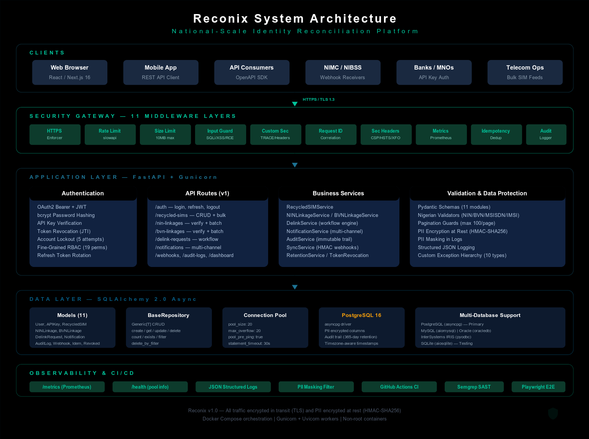
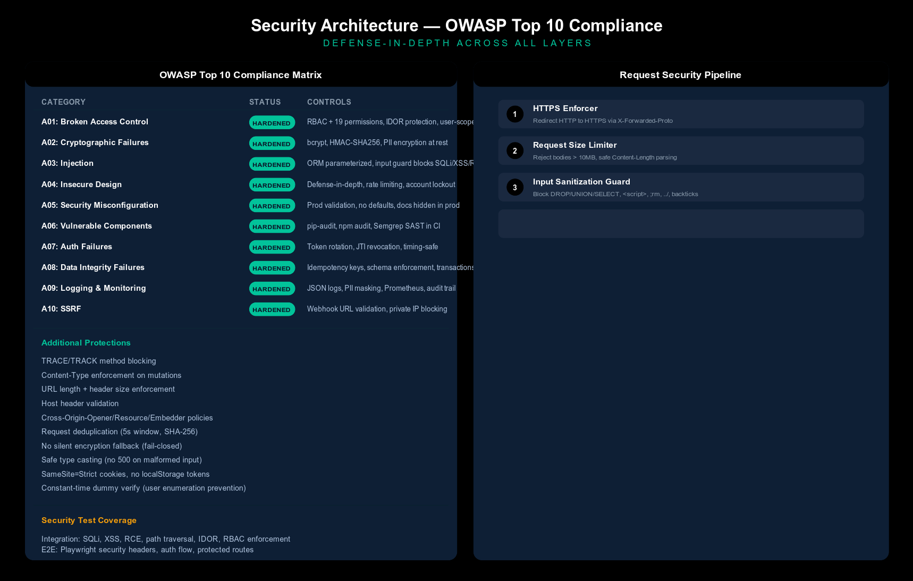
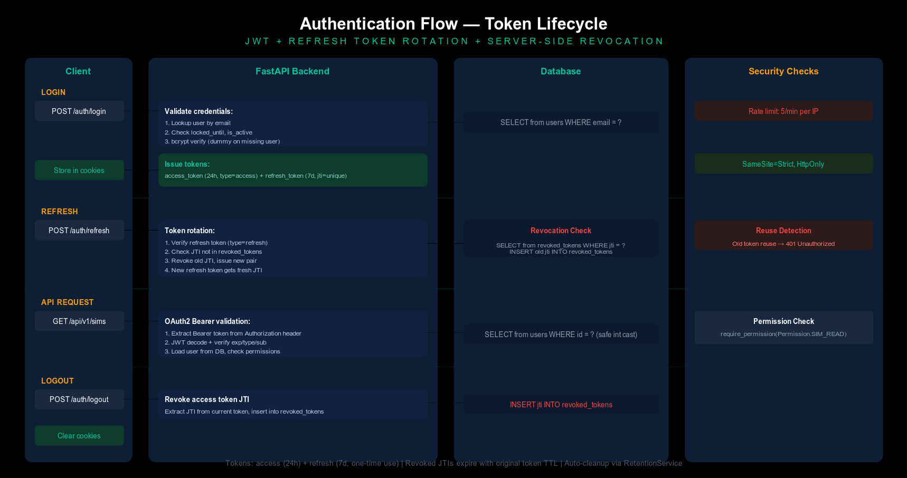

# Reconix — Architecture

## System Overview



<details>
<summary>Text-based diagram (for terminals)</summary>
<pre><code>         Internet
                       |
                 [Load Balancer]
                   /         \
          [Frontend]         [Backend]
          Next.js 16         FastAPI + Gunicorn
          Port 3000          Port 8000
               |                  |
               |            +-----+------+
               |            |            |
               |      [PostgreSQL]  [Redis]
               |       Port 5432    Port 6379
               |            |
               |      [Read Replica]
               |       (optional)
               |
         [CDN / CloudFront]
          (optional, static assets)
</code></pre>
</details>

---

## Component Architecture

### Backend (FastAPI)

```text
fast_api/
├── main.py                      # App factory, lifespan, middleware stack
├── api.py                       # Router aggregating 13 route modules
├── config.py                    # Pydantic settings with production validation
├── db.py                        # Async engine factory, BaseRepository[T], read replica
├── websocket.py                 # ConnectionManager for real-time notifications
├── logging_config.py            # Structured JSON logging + PII masking
├── crypto.py                    # Application-level PII field encryption
├── auth/authlib/                # OAuth2, JWT, bcrypt, RBAC, 19 permissions
├── routes/                      # 12 route modules
│   ├── auth.py                  # Login, refresh, logout
│   ├── recycled_sims.py         # SIM CRUD, bulk upload (10,000 records)
│   ├── nin_linkages.py          # NIN verification, bulk-check
│   ├── bvn_linkages.py          # BVN verification, bulk-check
│   ├── delink_requests.py       # Delink workflow (create/approve/reject/cancel)
│   ├── notifications.py         # Multi-channel dispatch (SMS/email/API)
│   ├── audit_logs.py            # Immutable audit trail
│   ├── dashboard.py             # Stats and trends (read replica)
│   ├── webhooks.py              # Stakeholder sync
│   ├── retention.py             # Audit log purge
│   ├── data_subject.py          # NDPR data subject rights
│   ├── identity.py              # Unified MSISDN status, linkages, corroboration
│   └── ws.py                    # WebSocket real-time notifications
├── services/                    # 15 business services (+ adapters, corroboration, sync)
├── models/                      # 12 SQLAlchemy models (+ stakeholder)
├── schemas/                     # 12 Pydantic schema modules
├── middleware/                   # 14 security/observability middleware
├── validators/                  # Nigerian data validators (NIN/BVN/MSISDN/IMSI)
└── exceptions/                  # 10 custom exception types + handlers
```

### Frontend (Next.js)

```text
src/
├── app/                         # App Router pages (9 routes)
├── components/                  # 22 feature components
├── hooks/                       # useAuth, usePagination, useWebSocket, etc.
├── services/                    # 9 API service modules
├── types/                       # TypeScript type definitions
└── tests/                       # Integration tests
```

---

## Middleware Pipeline (14 layers)

Every request passes through these middleware layers in order:

1. **HTTPS Enforcer** — Redirect HTTP to HTTPS in production
2. **Sentry** — Error capture and performance monitoring
3. **Tracing** — Distributed trace ID propagation (`X-Trace-ID`, `X-Span-ID`)
4. **Sunset Headers** — API versioning deprecation with RFC 8594 Sunset header
5. **Size Limiter** — Block request bodies exceeding 10 MB
6. **Input Guard** — Block SQLi, XSS, command injection, path traversal patterns
7. **Request ID** — Assign/propagate correlation IDs via `X-Request-ID`
8. **Security Headers** — CSP, HSTS, X-Frame-Options, Permissions-Policy
9. **Custom Security** — TRACE/TRACK blocking, Content-Type enforcement, COOP/CORP/COEP
10. **Metrics** — Prometheus request counters and latency histograms
11. **Idempotency** — User-scoped replay protection for POST/PUT/PATCH
12. **Deduplication** — SHA-256 fingerprint dedup within 5-second window
13. **Audit Logger** — Structured JSON with PII auto-masking
14. **CORS** — Strict origin allowlist (HTTPS-only in production)

---

## Security Architecture



---

## Authentication Flow



### Token Lifecycle

```text
Client                  Backend                  Database
│ -- POST /auth/login -->  │                           │
│ ------------------------ │ ------------------------- │
│                          │ <- user record ---------- │
│ <- access + refresh ---  │                           │
│                          │                           │
│ -- POST /auth/refresh -> │                           │
│                          │ -- check jti revoked? --> │
│                          │ -- revoke old jti ------> │
│ <- new access+refresh -- │                           │
│                          │                           │
│ -- POST /auth/logout --> │                           │
│                          │ -- revoke access jti ---> │
│ <- 200 OK -------------  │                           │
```

**Security hardening applied:**

- Constant-time dummy verify on non-existent user (timing attack mitigation)
- Account lockout after 5 failed attempts (15 min)
- Rate limiting: 5/min on auth endpoints, 100/min general
- No user enumeration (same error for invalid email vs password)
- Refresh tokens rotated on every use (one-time use)
- JWT stored in SameSite=Strict cookies (not localStorage)
- Production CSP removes `unsafe-eval` from `script-src`

---

## Deployment Architecture

```text
                    Internet
                       │
                 [Load Balancer]
                   /         \
          [Frontend]         [Backend]
          Next.js 16         FastAPI + Gunicorn
          Port 3000          Port 8000
                               │
                      ┌────────┴────────┐
                      │                 │
                [PostgreSQL 16]   [Read Replica]
                 Port 5432         (optional)
                      │
                   [Redis]
                 Port 6379
               (optional cache)
```

- **Frontend**: Multi-stage Node.js build, standalone Next.js output, CDN asset prefix
- **Backend**: Python 3.12-slim, Gunicorn with Uvicorn workers, non-root user
- **Database**: PostgreSQL 16 with persistent volume, connection pooling (20+20)
- **Caching**: Redis with in-memory fallback when not configured
- **Secrets**: HashiCorp Vault with environment variable fallback
- **CI/CD**: GitHub Actions — lint, test, type-check, Docker build, security scan
