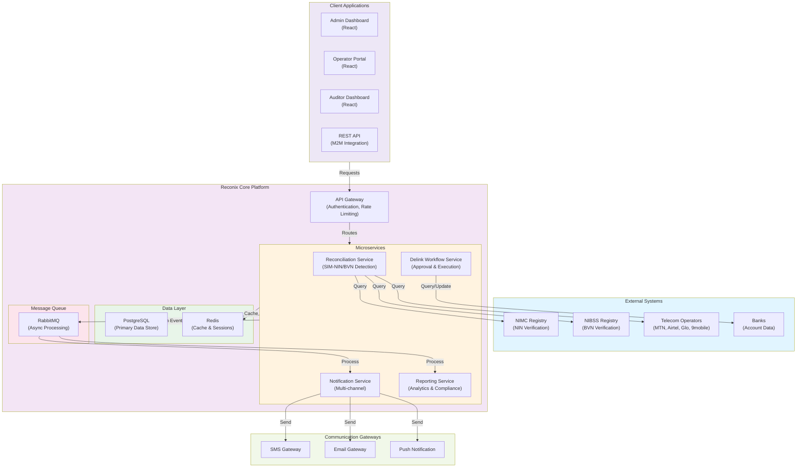
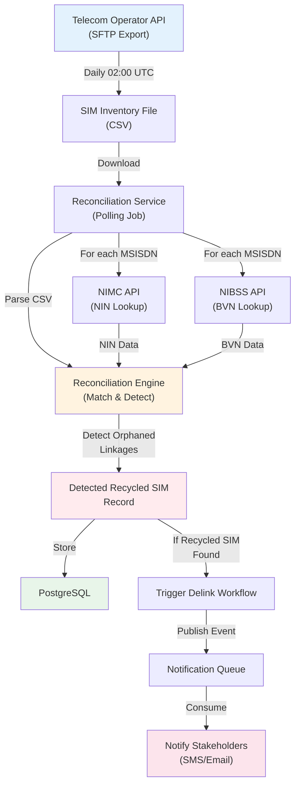
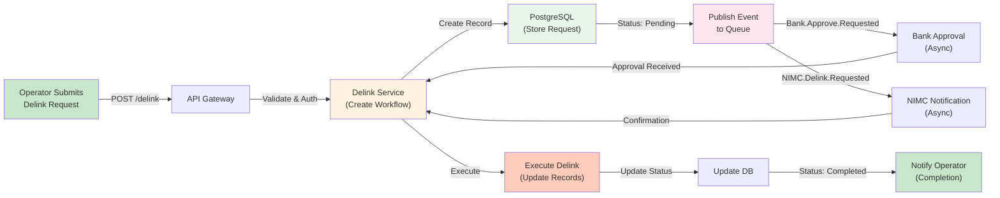

# Reconix Technical Architecture

## Executive Summary

Reconix is a national-scale identity reconciliation platform for Nigeria that detects recycled SIM cards still linked to old NIN (National Identification Number) and BVN (Bank Verification Number) records. The system provides automated delink workflows to maintain data integrity and security across the Nigerian telecom and financial sectors.

---

## 1. System Overview

### Purpose
Reconix addresses the critical security and compliance challenge where decommissioned SIM cards are recycled and reassigned to new customers while remaining linked to the previous owner's NIN/BVN records. This creates identity fraud risks, financial crimes, and regulatory compliance violations.

### Key Capabilities
- Real-time detection of recycled SIM-NIN/BVN linkages
- Automated notification and delink workflows
- Multi-stakeholder coordination (NIMC, NIBSS, telecom operators, banks)
- Comprehensive audit trails and compliance reporting
- Bulk import and processing of SIM reconciliation data

### Scope
- Covers all major Nigerian telecom operators (MTN, Airtel, Glo, 9mobile)
- Integrates with NIMC (National Identification Management Commission) and NIBSS (Nigerian Inter-Bank Settlement System)
- Supports multiple communication channels (SMS, Email, In-app notifications)
- Multi-tenant architecture with role-based access control

---

## 2. High-Level Architecture Diagram



---

## 3. Component Architecture

### 3.1 Frontend Components

#### Admin Dashboard
- User and role management
- System configuration
- Real-time monitoring and alerts
- Bulk SIM upload and processing
- Audit log visualization
- Report generation and export

**Technology Stack:** React 18, Redux, TypeScript, Material-UI, Chart.js

#### Operator Portal
- SIM reconciliation requests
- Delink workflow management
- Operator-specific reporting
- Notification history

**Technology Stack:** React 18, Redux, TypeScript, Material-UI

#### Auditor Dashboard
- Audit log examination
- Compliance reporting
- Data integrity verification
- Trend analysis

**Technology Stack:** React 18, Redux, TypeScript, Material-UI

#### REST API Documentation
- OpenAPI/Swagger specifications
- Interactive API explorer
- SDK documentation

---

### 3.2 Backend Services Architecture

#### API Gateway (Entry Point)
- JWT authentication and authorization
- Rate limiting (per API key, per IP)
- Request validation and sanitization
- Request/response logging
- CORS handling
- API versioning (v1, v2, etc.)

**Technology:** Node.js + Express, with authentication middleware

#### Reconciliation Service
**Responsibilities:**
- Polling telecom operator APIs for SIM inventory
- Cross-referencing SIM-MSISDN-IMSI mappings with NIMC NIN registry
- Cross-referencing MSISDN with NIBSS BVN records
- Detecting orphaned linkages (recycled SIMs with old owner data)
- Triggering delink workflows automatically
- Batch reconciliation job orchestration

**Technology:** Node.js, Bull (job queue), axios (HTTP client)

#### Delink Workflow Service
**Responsibilities:**
- Managing delink request lifecycle (submitted → approved → executed → completed)
- Multi-level approval workflows (operator → bank → NIMC)
- Executing delink operations on external systems
- Rollback mechanisms for failed delinks
- Workflow state persistence and recovery

**Technology:** Node.js, Workflow State Machine library

#### Notification Service
**Responsibilities:**
- Multi-channel notification dispatch (SMS, Email, In-app Push)
- Template-based message generation with variable substitution
- Notification retry logic with exponential backoff
- Delivery status tracking
- Notification preferences management

**Technology:** Node.js, Nodemailer, AWS SNS (for SMS/push)

#### Reporting Service
**Responsibilities:**
- Real-time dashboard metrics
- Historical analytics and trends
- Compliance report generation (PDF, Excel)
- Data export for external stakeholders
- Audit trail reports

**Technology:** Node.js, PostgreSQL queries, ReportLab (PDF generation)

---

### 3.3 Database Architecture

**Primary Database:** PostgreSQL 14+

**Key Tables:**
- recycled_sims: Detected recycled SIM records
- nin_linkages: MSISDN-NIN associations
- bvn_linkages: MSISDN-BVN associations
- delink_requests: Delink workflow records
- notifications: Notification dispatch history
- audit_logs: Complete audit trail
- users: System users and roles
- api_keys: API authentication tokens
- operators: Telecom operator reference data
- banks: Financial institution reference data
- notification_templates: Message templates
- system_config: Configuration key-value store

**Backups:** Daily incremental backups, weekly full backups, 90-day retention

**Replication:** Streaming replication to hot standby for HA

---

### 3.4 Caching Layer

**Redis Cluster:**
- Session storage (TTL: 24 hours)
- API response caching (TTL: 5-60 minutes, by endpoint)
- Rate limiting counters
- Real-time notification queue for dashboard push updates
- Distributed locks for concurrent delink operations

---

### 3.5 Message Queue

**RabbitMQ with Clustering:**
- Async notification dispatch
- Background reporting jobs
- Delink workflow events
- Audit log persistence
- Dead letter queues for failed messages (retry up to 5 times)

---

## 4. Integration Points

### 4.1 NIMC API Integration

**Purpose:** Verify NIN-to-identity mappings, validate NIN authenticity

**Interface:**
- REST API endpoint: `https://api.nimc.gov.ng/verify/nin`
- Authentication: API Key + mutual TLS
- Rate Limit: 10,000 requests/day
- Response Time: <2 seconds per request

**Data Exchanged:**
- Request: NIN (11-digit), MSISDN (optional)
- Response: Full Name, DOB, Gender, Photo URL, Verification Status

**Error Handling:** Retry up to 3 times with exponential backoff; fallback to cached data

**Compliance:** Adheres to NIMC API SLA and data protection requirements

---

### 4.2 NIBSS API Integration

**Purpose:** Verify BVN-to-account mappings, detect account holders

**Interface:**
- REST API endpoint: `https://api.nibss.ng/bvn/verify`
- Authentication: OAuth 2.0 client credentials flow
- Rate Limit: 5,000 requests/day
- Response Time: <1 second per request

**Data Exchanged:**
- Request: BVN (11-digit), MSISDN (optional)
- Response: Account Holder Name, Associated Accounts, Verification Status

**Error Handling:** Queue for batch processing during off-peak hours on API limit exceeded

**Compliance:** NIBSS security requirements and PCI-DSS data handling

---

### 4.3 Telecom Operator APIs

**Integrated Operators:** MTN, Airtel, Glo, 9mobile

**Interface Pattern (varies by operator):**
- SFTP bulk file export: Daily SIM inventory dumps (CSV)
- REST API: Real-time MSISDN-IMSI-SIM lookups
- Authentication: OAuth 2.0 or custom API keys + mutual TLS

**Data Exchanged:**
- Request: MSISDN or SIM Serial
- Response: Current subscriber info, SIM status, activation date, registration history

**Reconciliation Schedule:** Daily at 02:00 UTC (off-peak)

**Error Handling:** Fallback to previous day's data; operator outage alerts

---

### 4.4 SMS Gateway Integration

**Provider:** AWS SNS or Twilio

**Use Cases:**
- Notification to affected individuals
- OTP delivery for user verification
- Operator alerts
- Delink confirmation messages

**Rate Limits:** Up to 100 SMS/second

**Retry Policy:** Up to 5 retries, 60-second intervals

**Cost Optimization:** Batch SMS during off-peak hours

---

### 4.5 Email Gateway Integration

**Provider:** SendGrid or AWS SES

**Use Cases:**
- Bulk notification to account holders
- Delink approval workflow notifications
- Audit reports
- Compliance letters to operators/banks

**Rate Limits:** Up to 1,000 emails/minute

**Retry Policy:** Built-in retry with exponential backoff

---

## 5. Security Architecture

### 5.1 Authentication & Authorization

**API Authentication:**
- JWT (JSON Web Token) for user sessions
- API Key + HMAC signature for M2M (machine-to-machine) communication
- OAuth 2.0 for third-party integrations
- Mutual TLS for all external API calls

**Authorization Hierarchy:**
```
Admin
├─ System Configuration
├─ User Management
├─ Audit Log Access
└─ Full System Access

Operator
├─ View own SIM reconciliation data
├─ Submit delink requests
├─ View delink request history
└─ Receive operator-targeted reports

Bank
├─ Approve delink requests
├─ View delink status
└─ Receive bank-targeted reports

Auditor
├─ View audit logs (read-only)
├─ View compliance reports
└─ No modification permissions

API Client
├─ Query SIM status (read-only)
├─ Submit delink requests (write)
├─ Limited to assigned scopes
└─ Rate limited by API tier
```

**Role-Based Access Control (RBAC):** Implemented at middleware level

---

### 5.2 Encryption

**Data at Rest:**
- PostgreSQL Transparent Data Encryption (TDE) with AES-256
- Redis encrypted at application level before storage
- Backup encryption: AES-256-GCM
- Key Management: AWS KMS with automatic key rotation (annual)

**Data in Transit:**
- TLS 1.3 mandatory for all HTTP endpoints
- Mutual TLS for external API calls
- VPN for internal service-to-service communication
- SFTP with SSH key authentication for file transfers

**Sensitive Data Handling:**
- NIN and BVN never logged in plain text
- PII fields encrypted at database column level using pgcrypto
- SMS/Email content encrypted in transit
- Audit logs mask sensitive fields in UI (showing only hash/truncation)

---

### 5.3 API Gateway Security

```mermaid
graph LR
    Client["Client Request"]
    Gateway["API Gateway<br/>(WAF)"]
    RateLimit["Rate Limiting<br/>(Token Bucket)"]
    AuthN["Authentication<br/>(JWT/API Key)"]
    AuthZ["Authorization<br/>(RBAC)"]
    Validate["Validation<br/>(Schema)"]
    Service["Microservice"]

    Client -->|"1. Incoming"| Gateway
    Gateway -->|"2. Check WAF Rules"| RateLimit
    RateLimit -->|"3. Check Quota"| AuthN
    AuthN -->|"4. Verify Token"| AuthZ
    AuthZ -->|"5. Check Permissions"| Validate
    Validate -->|"6. Validate Payload"| Service
    Service -->|"7. Process"| Client

    style Gateway fill:#ffcdd2
    style RateLimit fill:#ffcdd2
    style AuthN fill:#ffcdd2
    style AuthZ fill:#ffcdd2
    style Validate fill:#ffcdd2
```



**WAF Rules:**
- SQL injection protection
- XSS prevention
- CORS validation
- DDoS mitigation (rate limiting per IP, per API key)
- Request size limits

**Rate Limiting:**
- Standard tier: 100 requests/minute per API key
- Premium tier: 1,000 requests/minute per API key
- Burst allowance: 20% above tier limit
- Penalty: 429 Too Many Requests with Retry-After header

---

### 5.4 Network Security

**Infrastructure:**
- VPC with public/private subnets
- NAT Gateway for outbound traffic from services
- Security Groups restricting traffic by port and protocol
- NACLs for subnet-level filtering
- No direct internet access to database

**Firewall Rules:**
- All inbound traffic through API Gateway only
- External API calls only through egress proxy
- Internal service communication via private network

---

### 5.5 Compliance & Audit

**Data Privacy:**
- GDPR-like compliance for personal data
- Right to be forgotten for delinked NIN/BVN
- Data retention policies (7-year audit log retention for compliance)
- Regular vulnerability assessments and penetration testing

**Audit Trail:**
- Immutable audit logs in PostgreSQL (append-only)
- Every user action logged with timestamp, user ID, IP, action, resource
- JSON diff for changes to sensitive records
- Audit logs cannot be modified or deleted (enforced at database level)

**Compliance Reports:**
- Monthly data protection impact assessments
- Quarterly security posture reports
- Annual third-party security audits

---

## 6. Deployment Architecture

### 6.1 Containerized Deployment

**Container Orchestration:** Kubernetes 1.28+

**Namespace Structure:**
```
└── reconix (main namespace)
    ├── api-gateway (1 pod, 2 replicas)
    ├── reconciliation-service (1 pod, 3 replicas)
    ├── delink-service (1 pod, 2 replicas)
    ├── notification-service (1 pod, 2 replicas)
    ├── reporting-service (1 pod, 1 replica)
    ├── postgres (StatefulSet, 1 primary + 2 replicas)
    ├── redis (StatefulSet, 3-node cluster)
    └── rabbitmq (StatefulSet, 3-node cluster)

└── monitoring (Prometheus, Grafana)

└── logging (ELK stack: Elasticsearch, Logstash, Kibana)

└── ingress (Nginx Ingress Controller)
```

**Docker Images:**
- Base: Node.js 20-alpine (minimal, secure)
- Scanning: Trivy for vulnerability scanning on all images
- Registry: Private ECR (Amazon Elastic Container Registry)
- Image signing: Docker Content Trust enabled

**Deployment Pipeline:**
```
Code Commit
    ↓
GitHub Actions: Build → Test → Security Scan
    ↓
Push to ECR
    ↓
GitOps: ArgoCD detects image update
    ↓
Automatic Deployment to Dev/Staging
    ↓
Manual Approval for Production
    ↓
Blue-Green Deployment (zero downtime)
```

---

### 6.2 Kubernetes Resources

**API Gateway Deployment:**
```yaml
replicas: 2
resources:
  requests:
    cpu: 500m
    memory: 512Mi
  limits:
    cpu: 1000m
    memory: 1Gi
livenessProbe:
  httpGet: /health
  initialDelaySeconds: 30
  periodSeconds: 10
readinessProbe:
  httpGet: /ready
  initialDelaySeconds: 5
  periodSeconds: 5
```

**Reconciliation Service Deployment:**
```yaml
replicas: 3
resources:
  requests:
    cpu: 1000m
    memory: 1Gi
  limits:
    cpu: 2000m
    memory: 2Gi
affinity:
  podAntiAffinity:
    requiredDuringSchedulingIgnoredDuringExecution:
      - labelSelector:
          matchExpressions:
            - key: app
              operator: In
              values:
                - reconciliation-service
        topologyKey: kubernetes.io/hostname
```

**StatefulSet for PostgreSQL:**
```yaml
serviceName: postgres-headless
replicas: 3
selector:
  matchLabels:
    app: postgres
volumeClaimTemplates:
  - metadata:
      name: data
    spec:
      accessModes: [ "ReadWriteOnce" ]
      resources:
        requests:
          storage: 500Gi
```

---

### 6.3 Ingress & Service Mesh

**Ingress Controller:** Nginx Ingress Controller

**Service Mesh:** Istio (optional, for advanced traffic management)

**Routes:**
- `/api/v1/*` → API Gateway
- `/admin/*` → Admin Dashboard (SPA)
- `/operator/*` → Operator Portal (SPA)
- `/auditor/*` → Auditor Dashboard (SPA)
- `/health` → Health check endpoint
- `/metrics` → Prometheus metrics

**TLS Certificates:**
- Automated via Let's Encrypt and cert-manager
- Certificate rotation: 60 days before expiry
- Wildcard certificates for *.reconix.gov.ng

---

### 6.4 High Availability Configuration

**Multi-AZ Deployment:**
- Pods spread across 3 availability zones
- Database replicas in separate AZs
- Load balancing via Kubernetes Service with round-robin

**Health Checks:**
- Liveness probes: Restart unhealthy containers
- Readiness probes: Remove unhealthy pods from load balancer
- Startup probes: Allow time for slow startup services

**Pod Disruption Budgets:**
- API Gateway: minAvailable: 1
- Services: minAvailable: 1
- Ensures graceful handling during node maintenance

**Auto-Scaling:**
```yaml
apiVersion: autoscaling/v2
kind: HorizontalPodAutoscaler
metadata:
  name: reconciliation-service-hpa
spec:
  scaleTargetRef:
    apiVersion: apps/v1
    kind: Deployment
    name: reconciliation-service
  minReplicas: 3
  maxReplicas: 10
  metrics:
  - type: Resource
    resource:
      name: cpu
      target:
        type: Utilization
        averageUtilization: 70
  - type: Resource
    resource:
      name: memory
      target:
        type: Utilization
        averageUtilization: 80
```

---

### 6.5 Configuration Management

**Environment Variables:**
- Development: Secret stored in AWS Secrets Manager
- Staging: Separate secrets for staging environment
- Production: KMS-encrypted secrets, rotated quarterly

**ConfigMaps for non-sensitive data:**
- API endpoints for external services
- Log levels
- Feature flags

**GitOps Approach:** Flux or ArgoCD syncs Kubernetes manifests from Git

---

## 7. Data Flow Architecture

### 7.1 SIM Reconciliation Data Flow



### 7.2 Delink Request Data Flow



---

## 8. Technology Stack Justification

| Component | Technology | Justification |
|-----------|-----------|----------------|
| **API Server** | Node.js + Express | High concurrency, excellent async handling for I/O-bound operations (external API calls) |
| **Frontend** | React 18 | Modern UI, component reusability, large developer community in Nigeria |
| **Database** | PostgreSQL 14+ | ACID compliance, advanced features (JSON, full-text search), excellent for complex queries |
| **Caching** | Redis | Fast in-memory operations, native clustering, supports multiple data structures |
| **Message Queue** | RabbitMQ | Reliable message delivery, routing capabilities, proven for high-volume systems |
| **Containerization** | Docker | Consistent environments, lightweight, industry standard |
| **Orchestration** | Kubernetes | Auto-scaling, self-healing, declarative configuration, multi-cloud capable |
| **Monitoring** | Prometheus + Grafana | Native K8s integration, time-series data, alerting |
| **Logging** | ELK Stack | Centralized logging, full-text search, visualization |
| **External APIs** | REST + mutual TLS | Standard, widely adopted, secure by design |

---

## 9. Scalability Considerations

### 9.1 Horizontal Scaling

**Stateless Services:**
- API Gateway, microservices deployable across multiple pods
- Automatic scaling based on CPU/memory/custom metrics
- Load balancing via Kubernetes Service

**Stateful Components:**
- PostgreSQL: Read replicas for read-heavy queries, primary for writes
- Redis: Cluster mode with automatic sharding
- RabbitMQ: Cluster with queue replication across nodes

### 9.2 Performance Optimization

**Database:**
- Indexing strategy on frequently queried columns (MSISDN, NIN, BVN)
- Query optimization: EXPLAIN ANALYZE for slow queries
- Connection pooling via PgBouncer (max 1,000 connections)
- Prepared statements to prevent SQL injection and improve performance

**Caching:**
- Redis caching for NIN/BVN lookup results (TTL: 1 hour)
- API response caching for high-frequency queries
- Cache invalidation strategy: Event-driven (publish cache invalidation events)

**Async Processing:**
- Long-running operations (reconciliation, reporting) via message queue
- Background jobs prevent request timeouts
- Job retries with exponential backoff

**API Optimization:**
- Pagination: default 50 items/page, max 1,000
- Field filtering: allow clients to request only needed fields
- Gzip compression for all responses >1KB

### 9.3 Load Projections

**Expected Growth:**
- Year 1: 10 million SIM records, 100 concurrent users, 1,000 API requests/second
- Year 3: 50 million SIM records, 500 concurrent users, 10,000 API requests/second

**Scaling Targets:**
- Database: 3-node PostgreSQL cluster with read replicas (scale to 5 nodes by Year 3)
- Services: Auto-scale from 2 to 10 replicas per service based on load
- Message Queue: 3-node RabbitMQ cluster (sufficient for Year 3 projections)

---

## 10. Disaster Recovery & Business Continuity

### 10.1 Recovery Objectives

| Metric | Target |
|--------|--------|
| **RTO (Recovery Time Objective)** | < 1 hour |
| **RPO (Recovery Point Objective)** | < 15 minutes |
| **Availability SLA** | 99.9% (43.2 minutes/month downtime) |

### 10.2 Backup Strategy

**PostgreSQL Backups:**
- **Frequency:** Continuous WAL (Write-Ahead Log) archival
- **Schedule:** Daily full backups at 23:00 UTC, incremental every 4 hours
- **Retention:** 90 days (meets compliance requirement)
- **Storage:** AWS S3 with cross-region replication to second region
- **Encryption:** AES-256-GCM

**Backup Testing:**
- Monthly restore drills to standby environment
- Automated integrity checks on all backups

### 10.3 Failover Procedures

**Primary Database Failover (Automatic):**
1. Health monitoring detects primary unhealthy (3 consecutive failed health checks, 30 seconds)
2. Automatic promotion of replica to primary (managed by replication controller)
3. Clients automatically reconnect to new primary via DNS alias
4. Recovery time: < 2 minutes

**Service Failover (Automatic):**
1. Kubernetes detects pod failure
2. New pod spun up on healthy node
3. Load balancer removes failed pod
4. Recovery time: < 30 seconds

**Multi-Region Failover (Manual):**
1. Secondary region pre-configured as standby
2. Traffic switch via DNS failover (Route 53 health-based routing)
3. Manual trigger via runbook, estimated 20 minutes to full switchover

### 10.4 Disaster Recovery Plan

**Runbook for Common Failures:**

**Scenario 1: Database Primary Failure**
- Automatic: Replica promoted to primary
- Manual: Verify data consistency, confirm replication lag < 1 minute
- Rollback: Restore from backup if data corruption detected

**Scenario 2: Kubernetes Cluster Node Failure**
- Automatic: Pods rescheduled to healthy nodes
- Manual: Investigate root cause, replace node
- Verification: All pods reach Running/Ready state

**Scenario 3: External API Degradation (NIMC/NIBSS)**
- Fallback: Use cached data from Redis (up to 1 hour old)
- Queuing: Reconciliation jobs placed on RabbitMQ for retry during recovery
- Notification: Alert operations team when fallback > 30 minutes

**Scenario 4: Regional Outage**
- Secondary region assumes all traffic
- DNS failover activates in < 5 minutes
- Verify all services operational in secondary region
- Estimated downtime: < 5 minutes

### 10.5 Data Consistency Safeguards

**During Failover:**
- Distributed transactions use 2-phase commit
- Compensating transactions for partially completed operations
- Idempotency keys on all mutation API endpoints prevent duplicate processing

**After Failover:**
- Reconciliation of delink requests in pending state
- Retry failed notifications
- Audit log verification for data loss

### 10.6 Business Continuity

**Emergency Contact Tree:**
- On-call engineer (escalation path for critical incidents)
- Service team lead
- Director of Operations
- CTO

**Communication:**
- Status page: https://status.reconix.gov.ng (updated every 15 minutes during incidents)
- Slack notifications to stakeholders
- SMS alerts to on-call team for P1 incidents

---

## 11. Monitoring & Observability

### 11.1 Metrics

**System Metrics:**
- CPU utilization, Memory usage, Disk I/O per pod
- Network latency (inter-service communication)
- Database query latency (p50, p95, p99)
- Message queue depth and processing latency

**Application Metrics:**
- Request rate (requests/second by endpoint)
- Error rate (5xx, 4xx responses)
- Latency distribution (p50, p95, p99)
- SIM reconciliation job success/failure rates
- Delink workflow completion time

**Business Metrics:**
- Number of recycled SIMs detected
- Number of active delink requests
- Notification delivery success rate
- User engagement (login frequency, active users)

### 11.2 Alerting

**P1 Alerts (Immediate Response):**
- API Gateway down
- Database primary unreachable
- External API unavailability > 5 minutes
- Message queue backlog > 10,000 messages

**P2 Alerts (Respond within 1 hour):**
- Error rate > 1%
- Latency p99 > 5 seconds
- RabbitMQ disk usage > 80%
- PostgreSQL replication lag > 5 minutes

**P3 Alerts (Business hours response):**
- Reconciliation job skipped (> 24 hours)
- Cache hit rate < 50%
- API rate limit approaching (> 90% of daily quota)

### 11.3 Dashboards

**Operational Dashboard:**
- System health status (green/yellow/red)
- Active pod count vs. desired
- Database replication lag
- Message queue depth
- Recent alerts

**SLA Dashboard:**
- Uptime percentage (rolling 30 days)
- Request latency trends
- Error rate trends
- Delink workflow SLA (completion within 48 hours)

---

## 12. Compliance & Regulatory

### 12.1 Data Protection Regulations

**Nigeria Data Protection Regulation (NDPR):**
- Data subject consent tracking
- Right to access, rectification, erasure
- Data protection impact assessments
- Breach notification within 3 days

**CBN Guidelines on Cybersecurity:**
- Multi-factor authentication for admin access
- Encryption of sensitive data
- Security incident response plan
- Annual security assessments

**NIMC Requirements:**
- NIN data handling per NIMC guidelines
- API SLA compliance
- Security certifications (ISO 27001)

### 12.2 Audit & Logging

**Immutable Audit Logs:**
- Append-only table in PostgreSQL
- Cannot be modified or deleted (enforced via trigger)
- Signed with cryptographic hash for tamper detection
- 7-year retention for compliance

**Audit Trail Content:**
- Timestamp (UTC), User ID, IP Address
- Resource modified, Action performed
- Old value, New value (JSON diff)
- Authorization check (permitted or denied)

### 12.3 Compliance Reporting

- Monthly data protection impact assessments
- Quarterly internal audit reports
- Annual third-party security audit (SOC 2 Type II)
- Ad-hoc incident reports to relevant authorities

---

## Conclusion

Reconix is architected as a secure, scalable, nation-scale platform leveraging modern cloud-native technologies. The system prioritizes data protection, high availability, and seamless integration with regulatory authorities and telecom operators. Regular assessment, monitoring, and disaster recovery drills ensure the platform remains resilient and compliant with Nigerian regulations.

