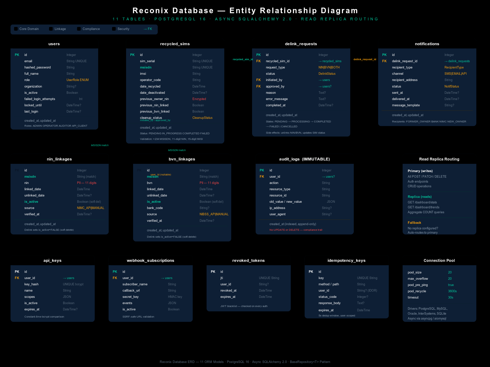
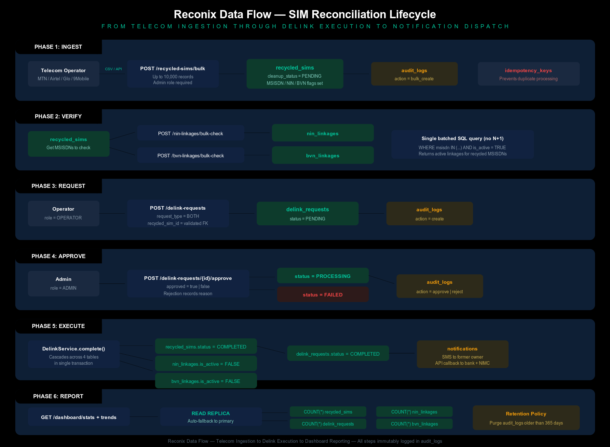

# Reconix Database Architecture

Comprehensive reference for the Reconix database layer: tables, relationships, data flows, state machines, read replica routing, and usage patterns across the application.

---

## Entity Relationship Diagram

<p align="center">
  
</p>

## Data Flow Diagram

<p align="center">
  
</p>

---

## Infrastructure

| Component         | Technology                | Configuration                                     |
| ----------------- | ------------------------- | ------------------------------------------------- |
| Primary database  | PostgreSQL 16 (asyncpg)   | Pool: 20 connections + 20 overflow, pre-ping      |
| Read replica      | PostgreSQL 16 (optional)  | Pool: 10 connections + 10 overflow, auto-fallback |
| ORM               | SQLAlchemy 2.0 async      | Declarative models, `BaseRepository<T>` pattern   |
| Session lifecycle | `async_sessionmaker`      | Commit on success, rollback on exception          |
| Pool health       | `pool_pre_ping=True`      | Stale connection detection before every query     |
| Pool recycling    | `pool_recycle=3600`       | Force reconnect after 1 hour                      |
| Multi-driver      | PostgreSQL, MySQL, Oracle | `DatabaseEngineFactory` adapter in `db.py`        |

### Connection Flow

```text
FastAPI Route
    │
    ▼
Depends(get_db)  ─── or ─── Depends(get_read_db)
    │                              │
    ▼                              ▼
async_sessionmaker(primary)   async_sessionmaker(replica)
    │                              │
    ▼                              ▼
AsyncEngine (write pool)      AsyncEngine (read pool)
    │                              │  ← falls back to primary
    ▼                              ▼     if replica not configured
PostgreSQL Primary            PostgreSQL Read Replica
```

---

## Tables

### 1. users

Stores all system accounts. Supports four roles with 19 fine-grained permissions. Includes brute-force protection via login attempt tracking and time-based account lockout.

| Column                  | Type           | Constraints                    | Description                          |
| ----------------------- | -------------- | ------------------------------ | ------------------------------------ |
| `id`                    | Integer        | PK, auto-increment             | Unique user identifier               |
| `email`                 | String(255)    | UNIQUE, NOT NULL               | Login credential                     |
| `hashed_password`       | String(255)    | NOT NULL                       | bcrypt hash (12 rounds)              |
| `full_name`             | String(255)    | NOT NULL                       | Display name                         |
| `role`                  | Enum(UserRole) | NOT NULL, default=OPERATOR     | ADMIN, OPERATOR, AUDITOR, API_CLIENT |
| `organization`          | String(255)    | nullable                       | Employer or agency                   |
| `is_active`             | Boolean        | NOT NULL, default=TRUE         | Soft disable without deletion        |
| `failed_login_attempts` | Integer        | NOT NULL, default=0            | Counter for lockout trigger          |
| `locked_until`          | DateTime(tz)   | nullable                       | Account locked until this timestamp  |
| `last_login`            | DateTime(tz)   | nullable                       | Last successful authentication       |
| `created_at`            | DateTime(tz)   | server_default=now()           | Registration timestamp               |
| `updated_at`            | DateTime(tz)   | server_default=now(), onupdate | Last profile modification            |

**Relationships:** owns `api_keys`, `webhook_subscriptions`; initiates/approves `delink_requests`; referenced by `audit_logs`

**Used by:**

- `POST /auth/login` — Authenticate, check lockout, update `last_login`
- `POST /auth/refresh` — Verify user exists via `sub` claim
- `POST /auth/logout` — Revoke token JTI
- All authenticated routes — `get_current_user` fetches from this table
- `UserService` — CRUD, `increment_login_attempts()`, `lock_user_account()`, `reset_login_attempts()`

**Security controls:** Constant-time dummy verify on non-existent emails (timing attack mitigation). Account locked for 15 minutes after 5 failed attempts. Same error message for invalid email vs invalid password (no user enumeration).

---

### 2. recycled_sims

Core domain entity. Each record represents a SIM card detected as recycled by a telecom operator. Tracks whether old NIN/BVN linkages exist and the cleanup lifecycle.

| Column                | Type                | Constraints                    | Description                             |
| --------------------- | ------------------- | ------------------------------ | --------------------------------------- |
| `id`                  | Integer             | PK, indexed                    | Unique SIM record identifier            |
| `sim_serial`          | String(50)          | UNIQUE, NOT NULL, indexed      | SIM card serial number                  |
| `msisdn`              | String(20)          | UNIQUE, NOT NULL, indexed      | Phone number (+234 format)              |
| `imsi`                | String(20)          | NOT NULL, indexed              | International Mobile Subscriber ID      |
| `operator_code`       | String(10)          | NOT NULL, indexed              | MTN, GLO, AIRTEL, 9MOBILE               |
| `date_recycled`       | DateTime(tz)        | NOT NULL                       | When the SIM was recycled               |
| `date_deactivated`    | DateTime(tz)        | nullable                       | When the old SIM was deactivated        |
| `previous_owner_nin`  | String(20)          | nullable, indexed              | Former owner NIN (encrypted at rest)    |
| `previous_nin_linked` | Boolean             | NOT NULL, default=FALSE        | Does old NIN linkage still exist?       |
| `previous_bvn_linked` | Boolean             | NOT NULL, default=FALSE        | Does old BVN linkage still exist?       |
| `cleanup_status`      | Enum(CleanupStatus) | NOT NULL, default=PENDING      | PENDING, IN_PROGRESS, COMPLETED, FAILED |
| `created_at`          | DateTime(tz)        | server_default=now()           | When record was ingested                |
| `updated_at`          | DateTime(tz)        | server_default=now(), onupdate | Last status change                      |

**Relationships:** referenced by `delink_requests.recycled_sim_id` FK; linked to `nin_linkages` and `bvn_linkages` via MSISDN match

**Used by:**

- `POST /recycled-sims` — Register a single detected recycled SIM (admin/operator)
- `POST /recycled-sims/bulk` — Bulk upload up to 10,000 records from telecom feed (admin only)
- `GET /recycled-sims` — Paginated list with `cleanup_status` filter
- `GET /recycled-sims/{id}` — Detail view
- `PATCH /recycled-sims/{id}` — Update cleanup status (admin/operator)
- `GET /dashboard/stats` — COUNT by cleanup_status for dashboard cards
- `GET /dashboard/trends` — COUNT created in period for trend charts
- `DelinkService.complete_delink_request()` — Sets `cleanup_status = COMPLETED`
- `DelinkService.fail_delink_request()` — Sets `cleanup_status = FAILED`

**Validation:** MSISDN validated against Nigerian format `^(\+234|0)[0-9]{10}$`. NIN validated as 11 digits. IMSI validated as 15 digits. Operator code validated against known codes.

---

### 3. nin_linkages

Tracks MSISDN-to-NIN (National Identification Number) bindings sourced from NIMC (National Identity Management Commission). Uses soft-delete pattern: `is_active` is set to `FALSE` when a linkage is delinked, preserving the historical record.

| Column          | Type                   | Constraints                     | Description                         |
| --------------- | ---------------------- | ------------------------------- | ----------------------------------- |
| `id`            | Integer                | PK, indexed                     | Unique linkage identifier           |
| `msisdn`        | String(20)             | NOT NULL, indexed               | Phone number                        |
| `nin`           | String(20)             | NOT NULL, indexed               | National Identification Number      |
| `linked_date`   | DateTime(tz)           | NOT NULL                        | When NIMC linked this NIN to MSISDN |
| `unlinked_date` | DateTime(tz)           | nullable                        | When the linkage was delinked       |
| `is_active`     | Boolean                | NOT NULL, default=TRUE, indexed | FALSE after delinking               |
| `source`        | Enum(NINLinkageSource) | NOT NULL, default=NIMC_API      | NIMC_API, MANUAL, BULK_UPLOAD       |
| `verified_at`   | DateTime(tz)           | nullable                        | Last NIMC verification timestamp    |
| `created_at`    | DateTime(tz)           | server_default=now()            | Record creation                     |
| `updated_at`    | DateTime(tz)           | server_default=now(), onupdate  | Last modification                   |

**Used by:**

- `POST /nin-linkages/verify` — Check if an MSISDN has an active NIN linkage
- `POST /nin-linkages/bulk-check` — Batch check multiple MSISDNs in a single query (no N+1)
- `GET /dashboard/stats` — COUNT of active NIN linkages
- `NINLinkageService.unlink()` — Sets `is_active=FALSE`, `unlinked_date=now()` during delink execution

---

### 4. bvn_linkages

Tracks MSISDN-to-BVN (Bank Verification Number) bindings sourced from NIBSS (Nigeria Inter-Bank Settlement System). Same soft-delete pattern as NIN linkages. Includes `bank_code` to identify which financial institution holds the linkage.

| Column          | Type                   | Constraints                     | Description                           |
| --------------- | ---------------------- | ------------------------------- | ------------------------------------- |
| `id`            | Integer                | PK, indexed                     | Unique linkage identifier             |
| `msisdn`        | String(20)             | NOT NULL, indexed               | Phone number                          |
| `bvn`           | String(20)             | NOT NULL, indexed               | Bank Verification Number              |
| `linked_date`   | DateTime(tz)           | NOT NULL                        | When NIBSS linked this BVN to MSISDN  |
| `unlinked_date` | DateTime(tz)           | nullable                        | When the linkage was delinked         |
| `is_active`     | Boolean                | NOT NULL, default=TRUE, indexed | FALSE after delinking                 |
| `bank_code`     | String(10)             | nullable                        | Financial institution code (e.g. 007) |
| `source`        | Enum(BVNLinkageSource) | NOT NULL, default=NIBSS_API     | NIBSS_API, MANUAL, BULK_UPLOAD        |
| `verified_at`   | DateTime(tz)           | nullable                        | Last NIBSS verification timestamp     |
| `created_at`    | DateTime(tz)           | server_default=now()            | Record creation                       |
| `updated_at`    | DateTime(tz)           | server_default=now(), onupdate  | Last modification                     |

**Used by:**

- `POST /bvn-linkages/verify` — Check if an MSISDN has an active BVN linkage
- `POST /bvn-linkages/bulk-check` — Batch check multiple MSISDNs in a single query
- `GET /dashboard/stats` — COUNT of active BVN linkages
- `BVNLinkageService.unlink()` — Sets `is_active=FALSE`, `unlinked_date=now()` during delink execution

---

### 5. delink_requests

Workflow orchestration table. Each record represents a request to delink a recycled SIM from its old NIN/BVN bindings. Implements a state machine: PENDING, PROCESSING, COMPLETED, FAILED, CANCELLED.

| Column            | Type                      | Constraints                    | Description                             |
| ----------------- | ------------------------- | ------------------------------ | --------------------------------------- |
| `id`              | Integer                   | PK, indexed                    | Unique request identifier               |
| `recycled_sim_id` | Integer                   | FK(recycled_sims.id), NOT NULL | Which SIM is being delinked             |
| `request_type`    | Enum(DelinkRequestType)   | NOT NULL, default=BOTH         | NIN, BVN, or BOTH                       |
| `status`          | Enum(DelinkRequestStatus) | NOT NULL, default=PENDING      | Current workflow state                  |
| `initiated_by`    | Integer                   | FK(users.id), NOT NULL         | Operator who created the request        |
| `approved_by`     | Integer                   | FK(users.id), nullable         | Admin who approved/rejected             |
| `reason`          | Text                      | nullable                       | Justification for the delink            |
| `error_message`   | Text                      | nullable                       | Failure details if status=FAILED        |
| `completed_at`    | DateTime(tz)              | nullable                       | When the request reached terminal state |
| `created_at`      | DateTime(tz)              | server_default=now()           | Request submission time                 |
| `updated_at`      | DateTime(tz)              | server_default=now(), onupdate | Last status transition                  |

**State Machine:**

```text
                ┌─────────► CANCELLED
                │
PENDING ────► PROCESSING ────► COMPLETED
                │                   │
                └──────► FAILED     │
                                    ▼
                          recycled_sims.cleanup_status = COMPLETED
                          nin_linkages.is_active = FALSE
                          bvn_linkages.is_active = FALSE
                          notifications created for affected parties
```

**Used by:**

- `POST /delink-requests` — Operator/admin creates request (validates recycled_sim_id FK exists)
- `GET /delink-requests` — Paginated list with status filter
- `GET /delink-requests/{id}` — Detail view
- `POST /delink-requests/{id}/approve` — Admin approves (PENDING to PROCESSING) or rejects (PENDING to FAILED)
- `POST /delink-requests/{id}/cancel` — Admin/operator cancels (PENDING/PROCESSING to CANCELLED)
- `GET /dashboard/stats` — COUNT by status for dashboard cards
- `GET /dashboard/trends` — COUNT created in period for trend charts
- `DelinkService` — Full lifecycle: `create`, `approve`, `reject`, `complete`, `fail`, `cancel`

**Side effects on approval:**

1. `recycled_sims.cleanup_status` updated to `COMPLETED` or `FAILED`
2. `nin_linkages` matching the SIM's MSISDN are soft-deleted (`is_active=FALSE`)
3. `bvn_linkages` matching the SIM's MSISDN are soft-deleted (`is_active=FALSE`)
4. `notifications` created for former owner, bank, and NIMC

---

### 6. notifications

Tracks multi-channel notification dispatch to affected parties during the delink workflow. Supports SMS, email, and API callback channels.

| Column              | Type                            | Constraints                      | Description                         |
| ------------------- | ------------------------------- | -------------------------------- | ----------------------------------- |
| `id`                | Integer                         | PK, indexed                      | Unique notification identifier      |
| `delink_request_id` | Integer                         | FK(delink_requests.id), NOT NULL | Which delink triggered this         |
| `recipient_type`    | Enum(NotificationRecipientType) | NOT NULL, default=FORMER_OWNER   | FORMER_OWNER, BANK, NIMC, NEW_OWNER |
| `channel`           | Enum(NotificationChannel)       | NOT NULL, default=EMAIL          | SMS, EMAIL, API_CALLBACK            |
| `recipient_address` | String(255)                     | NOT NULL                         | Phone number or email address       |
| `status`            | Enum(NotificationStatus)        | NOT NULL, default=PENDING        | PENDING, SENT, DELIVERED, FAILED    |
| `sent_at`           | DateTime(tz)                    | nullable                         | When dispatch was attempted         |
| `delivered_at`      | DateTime(tz)                    | nullable                         | When delivery was confirmed         |
| `message_template`  | String(100)                     | nullable                         | Template key (e.g. delink_notice)   |
| `created_at`        | DateTime(tz)                    | server_default=now()             | Record creation                     |
| `updated_at`        | DateTime(tz)                    | server_default=now(), onupdate   | Last status update                  |

**Used by:**

- `POST /notifications` — Admin/operator sends notification (requires delink_request_id)
- `GET /notifications` — Paginated list with status and channel filters
- `GET /notifications/{id}` — Detail view
- `NotificationService` — `create_notification()`, `mark_sent()`, `mark_delivered()`, `mark_failed()`

---

### 7. audit_logs (IMMUTABLE)

Append-only compliance trail. Every state-changing action in the system is logged with before/after values, the acting user, IP address, and user agent. Records cannot be updated or deleted through the ORM. Expired records are purged via the retention endpoint.

| Column          | Type         | Constraints                     | Description                            |
| --------------- | ------------ | ------------------------------- | -------------------------------------- |
| `id`            | Integer      | PK, indexed                     | Unique log entry identifier            |
| `user_id`       | Integer      | FK(users.id), nullable, indexed | Who performed the action (null=system) |
| `action`        | String(100)  | NOT NULL, indexed               | create, update, delete, login, etc.    |
| `resource_type` | String(100)  | NOT NULL, indexed               | RecycledSIM, DelinkRequest, User, etc. |
| `resource_id`   | String(50)   | NOT NULL, indexed               | ID of the affected resource            |
| `old_value`     | JSON         | nullable                        | State before the change                |
| `new_value`     | JSON         | nullable                        | State after the change                 |
| `ip_address`    | String(45)   | nullable                        | Client IP (IPv4 or IPv6)               |
| `user_agent`    | String(500)  | nullable                        | Client user agent string               |
| `created_at`    | DateTime(tz) | server_default=now(), indexed   | When the action occurred               |

**Used by:**

- `AuditLoggingMiddleware` — Automatically logs every request via middleware
- `GET /audit-logs` — Admin/auditor read access (paginated, filterable)
- `GET /audit-logs/resource/{type}/{id}` — Logs for a specific resource
- `POST /retention/purge-audit-logs` — Admin purges records older than `AUDIT_LOG_RETENTION_DAYS`
- `GET /data-subject/my-data` — COUNT of user's audit entries for NDPR export

**PII handling:** All log output passes through `PIIMaskingFilter` which redacts NIN/BVN/MSISDN patterns before writing to stdout/files. The `old_value` and `new_value` JSON fields may contain PII but are only accessible to admin/auditor roles.

---

### 8. api_keys

Machine-to-machine authentication for external system integrations (telecom APIs, NIMC/NIBSS webhook endpoints). Keys are stored as bcrypt hashes with constant-time comparison.

| Column         | Type         | Constraints                     | Description                    |
| -------------- | ------------ | ------------------------------- | ------------------------------ |
| `id`           | Integer      | PK, indexed                     | Unique key identifier          |
| `user_id`      | Integer      | FK(users.id), NOT NULL, indexed | Owning user account            |
| `key_hash`     | String(255)  | UNIQUE, NOT NULL                | bcrypt hash of the API key     |
| `name`         | String(255)  | NOT NULL                        | Human-readable key name        |
| `scopes`       | JSON         | NOT NULL, default=[]            | Permitted operations           |
| `is_active`    | Boolean      | NOT NULL, default=TRUE          | Soft revocation                |
| `expires_at`   | DateTime(tz) | nullable                        | Key expiry timestamp           |
| `created_at`   | DateTime(tz) | server_default=now()            | Key creation timestamp         |
| `last_used_at` | DateTime(tz) | nullable                        | Last successful authentication |

**Used by:**

- `POST /webhooks/receive` — External systems authenticate via `X-API-Key` header
- `verify_api_key()` dependency — Loads only active, non-expired keys; constant-time bcrypt verify

---

### 9. webhook_subscriptions

Event subscription management for external stakeholder sync. Banks and NIMC register callback URLs to receive delink event notifications.

| Column              | Type         | Constraints            | Description                            |
| ------------------- | ------------ | ---------------------- | -------------------------------------- |
| `id`                | Integer      | PK, indexed            | Unique subscription identifier         |
| `subscriber_name`   | String(255)  | NOT NULL               | Organization name                      |
| `callback_url`      | String(500)  | NOT NULL               | HTTPS endpoint for event delivery      |
| `secret_key`        | String(255)  | NOT NULL               | HMAC signing key for payload integrity |
| `events`            | JSON         | default=[]             | Event types to subscribe to            |
| `is_active`         | Boolean      | default=TRUE           | Subscription enabled/disabled          |
| `user_id`           | Integer      | FK(users.id), NOT NULL | Who registered this subscription       |
| `created_at`        | DateTime(tz) | server_default=now()   | Registration timestamp                 |
| `last_triggered_at` | DateTime(tz) | nullable               | Last event dispatch                    |

**Used by:**

- `POST /webhooks/register` — Admin/operator registers a subscription
- `GET /webhooks/subscriptions` — List all subscriptions
- `DELETE /webhooks/subscriptions/{id}` — Admin deactivates a subscription
- `SyncService.receive_update()` — Processes incoming webhook payloads

**Security:** Callback URLs are validated server-side (SSRF protection blocks private IPs, loopback, and cloud metadata endpoints). Secret keys are auto-generated via `secrets.token_urlsafe(32)`.

---

### 10. revoked_tokens

JWT blacklist table. Stores JTI (JWT ID) claims of revoked tokens. Checked on every authenticated request and during token refresh. Expired entries are auto-cleaned.

| Column       | Type         | Constraints               | Description                       |
| ------------ | ------------ | ------------------------- | --------------------------------- |
| `id`         | Integer      | PK, indexed               | Unique entry identifier           |
| `jti`        | String(64)   | UNIQUE, NOT NULL, indexed | JWT ID claim being revoked        |
| `user_id`    | String(64)   | nullable                  | User who owned the token          |
| `revoked_at` | DateTime(tz) | server_default=now()      | When the token was revoked        |
| `expires_at` | DateTime(tz) | NOT NULL                  | When the token would have expired |

**Used by:**

- `POST /auth/logout` — Revokes the current access token JTI
- `POST /auth/refresh` — Revokes the old refresh token JTI before issuing a new pair
- `TokenRevocationService.is_revoked()` — Checked during token validation
- `TokenRevocationService.cleanup_expired()` — Removes entries past `expires_at`

**Token lifecycle:**

```text
Login ──► access_token (24h) + refresh_token (7d, unique JTI)
           │
           ├─ Refresh ──► old refresh JTI revoked ──► new pair issued
           │
           └─ Logout ──► access JTI revoked
                          │
                          └─ Reuse attempt ──► 401 Unauthorized
```

---

### 11. idempotency_keys

Request deduplication table. The `IdempotencyMiddleware` intercepts POST/PUT/PATCH requests carrying an `Idempotency-Key` header. If the key has been seen before, the stored response is replayed. Keys are scoped per-user to prevent IDOR.

| Column          | Type         | Constraints               | Description                            |
| --------------- | ------------ | ------------------------- | -------------------------------------- |
| `id`            | Integer      | PK, indexed               | Unique entry identifier                |
| `key`           | String(255)  | UNIQUE, NOT NULL, indexed | Client-provided idempotency key        |
| `method`        | String(10)   | NOT NULL                  | HTTP method (POST, PUT, PATCH)         |
| `path`          | String(500)  | NOT NULL                  | Request path                           |
| `user_id`       | String(64)   | nullable                  | Scoped to requesting user (IDOR safe)  |
| `status_code`   | Integer      | nullable                  | Stored HTTP response status            |
| `response_body` | Text         | nullable                  | Stored HTTP response body              |
| `created_at`    | DateTime(tz) | server_default=now()      | When the key was first seen            |
| `expires_at`    | DateTime(tz) | NOT NULL                  | When the key expires (5s dedup window) |

**Used by:** `IdempotencyMiddleware` (auto-managed, no direct route access)

---

## End-to-End Data Flow

This section traces how data moves through the tables during the primary business workflow.

### Step 1: SIM Ingestion

A telecom operator submits a batch of recycled SIM records via `POST /recycled-sims/bulk`.

```text
Telecom CSV ──► POST /recycled-sims/bulk ──► recycled_sims (up to 10,000 rows)
                      │                         cleanup_status = PENDING
                      │                         previous_nin_linked = TRUE/FALSE
                      │                         previous_bvn_linked = TRUE/FALSE
                      ▼
               audit_logs (action=bulk_create, resource_type=RecycledSIM)
```

### Step 2: Linkage Verification

The operator verifies which recycled SIMs still have active NIN/BVN linkages.

```text
POST /nin-linkages/bulk-check ──► nin_linkages WHERE msisdn IN (...) AND is_active=TRUE
POST /bvn-linkages/bulk-check ──► bvn_linkages WHERE msisdn IN (...) AND is_active=TRUE
```

Both queries are batched into a single SQL `WHERE IN` clause (no N+1). Results indicate which SIMs require delinking.

### Step 3: Delink Request Creation

The operator submits a delink request for a SIM with stale linkages.

```text
POST /delink-requests ──► delink_requests (status=PENDING, request_type=BOTH)
                              │
                              ├── validates recycled_sim_id FK exists
                              ├── records initiated_by = current_user.id
                              ▼
                         audit_logs (action=create, resource_type=DelinkRequest)
```

### Step 4: Admin Approval

An admin reviews and approves (or rejects) the delink request.

```text
POST /delink-requests/{id}/approve ──► delink_requests.status = PROCESSING
                                           │
                                           ├── approved_by = admin.id
                                           ▼
                                      audit_logs (action=approve)
```

On rejection:

```text
POST /delink-requests/{id}/approve (approved=false) ──► delink_requests.status = FAILED
                                                            │
                                                            ├── error_message = rejection reason
                                                            ▼
                                                       audit_logs (action=reject)
```

### Step 5: Delink Execution

When a delink request is completed, the system cascades changes across three tables.

```text
DelinkService.complete_delink_request()
    │
    ├── recycled_sims.cleanup_status = COMPLETED
    │
    ├── nin_linkages SET is_active=FALSE, unlinked_date=now()
    │   WHERE msisdn = recycled_sim.msisdn AND is_active=TRUE
    │
    ├── bvn_linkages SET is_active=FALSE, unlinked_date=now()
    │   WHERE msisdn = recycled_sim.msisdn AND is_active=TRUE
    │
    ├── delink_requests.status = COMPLETED, completed_at=now()
    │
    └── notifications created:
        ├── FORMER_OWNER via SMS
        ├── BANK via API_CALLBACK
        └── NIMC via API_CALLBACK
```

### Step 6: Notification Dispatch

Notifications are created and tracked through their own lifecycle.

```text
notifications.status:  PENDING ──► SENT ──► DELIVERED
                                       └──► FAILED (retry or escalate)
```

### Step 7: Dashboard Reporting

Dashboard queries aggregate across multiple tables using the read replica (when configured).

```text
GET /dashboard/stats (via read replica)
    ├── SELECT COUNT(*) FROM recycled_sims GROUP BY cleanup_status
    ├── SELECT COUNT(*) FROM nin_linkages WHERE is_active=TRUE
    ├── SELECT COUNT(*) FROM bvn_linkages WHERE is_active=TRUE
    └── SELECT COUNT(*) FROM delink_requests GROUP BY status

GET /dashboard/trends (via read replica)
    ├── SELECT COUNT(*) FROM recycled_sims WHERE created_at >= cutoff
    └── SELECT COUNT(*) FROM delink_requests WHERE created_at >= cutoff
```

---

## Enum Reference

### UserRole

| Value        | Description                                       | Permissions        |
| ------------ | ------------------------------------------------- | ------------------ |
| `ADMIN`      | Full system access, user management, audit access | All 19 permissions |
| `OPERATOR`   | SIM management, delink requests, notifications    | 12 permissions     |
| `AUDITOR`    | Read-only access to audit logs and reports        | 5 permissions      |
| `API_CLIENT` | Machine-to-machine via API key                    | Scoped per key     |

### CleanupStatus (RecycledSIM)

| Value         | Description                                   |
| ------------- | --------------------------------------------- |
| `PENDING`     | Detected but not yet processed                |
| `IN_PROGRESS` | Delink request submitted, awaiting completion |
| `COMPLETED`   | All linkages delinked, notifications sent     |
| `FAILED`      | Delink failed, requires manual intervention   |

### DelinkRequestStatus

| Value        | Description                                   |
| ------------ | --------------------------------------------- |
| `PENDING`    | Awaiting admin approval                       |
| `PROCESSING` | Approved, delink execution in progress        |
| `COMPLETED`  | All linkages successfully delinked            |
| `FAILED`     | Execution failed or request rejected by admin |
| `CANCELLED`  | Withdrawn by operator or admin                |

### NotificationStatus

| Value       | Description                    |
| ----------- | ------------------------------ |
| `PENDING`   | Queued for dispatch            |
| `SENT`      | Dispatched to channel provider |
| `DELIVERED` | Delivery confirmed by provider |
| `FAILED`    | Delivery failed after attempts |

---

## Read Replica Routing

When `DATABASE_READ_REPLICA_URL` is set, read-heavy dashboard queries are routed to the replica. All other queries use the primary engine. If no replica is configured, `get_read_db()` falls back to the primary transparently.

| Dependency      | Engine       | Routes                                          |
| --------------- | ------------ | ----------------------------------------------- |
| `get_db()`      | Primary      | All write routes, auth, CRUD operations         |
| `get_read_db()` | Read replica | `GET /dashboard/stats`, `GET /dashboard/trends` |

The replica pool is sized at half the primary pool (10 + 10 overflow) to reflect the read-only workload distribution.

---

## Retention and Cleanup

| Table              | Retention Policy                                  | Cleanup Mechanism                               |
| ------------------ | ------------------------------------------------- | ----------------------------------------------- |
| `audit_logs`       | Configurable via `AUDIT_LOG_RETENTION_DAYS` (365) | `POST /retention/purge-audit-logs` (admin only) |
| `revoked_tokens`   | Until `expires_at` passes                         | `TokenRevocationService.cleanup_expired()`      |
| `idempotency_keys` | 5-second dedup window                             | Automatic expiry via `expires_at`               |
| All other tables   | No automatic purge                                | Manual via admin operations                     |
